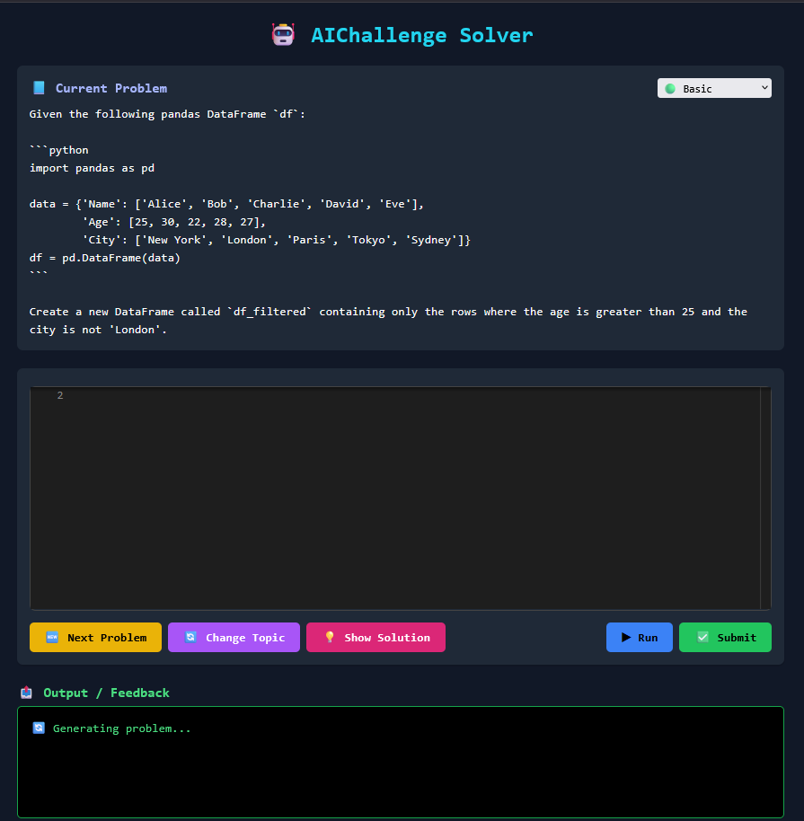

# 🧠 AI Coding Solver

AI_Coding_Solver is a web-based application that generates Python programming problems using AI and evaluates user-submitted code for correctness. It provides real-time feedback, ideal for learning and practicing Python from basic to advanced levels.

## 🚀 Features

- ✅ AI-generated Python programming questions (Beginner to Advanced)
- 💡 Instant code evaluation and correctness feedback
- 🔄 Auto-generate next problem if the solution is correct
- 🧪 Error feedback and hints if the answer is incorrect
- 🖥️ Integrated code editor in the browser
- 🌐 Built using Flask (Backend) and Tailwind CSS (Frontend)
- 🧠 Powered by Google Gemini / GPT-4 / LLMs

---

## 📸 Screenshot



---

## 🛠️ Tech Stack

- **Frontend**: HTML, Tailwind CSS, JavaScript
- **Backend**: Python, Flask
- **AI API**: Google Gemini / OpenAI GPT (customizable)
- **Editor**: CodeMirror

---

## 📦 Installation & Setup

1. **Clone the repository**:

```bash
git clone https://github.com/yourusername/AI_Coding_Solver.git
cd AI_Coding_Solver
```

2. **Create a virtual environment** (recommended):

```bash
python -m venv .venv
source .venv/bin/activate  # On Windows: .venv\Scripts\activate
```

3. **Install dependencies**:

```bash
pip install -r requirements.txt
```

4. **Set your API Key** (Google Gemini or OpenAI):

Edit `config.py` and add:
```python
GEMINI_API_KEY = 'your-api-key-here'
```

5. **Run the app**:

```bash
python app.py
```

6. **Visit in your browser**:

```
http://localhost:5000
```

---

## ✨ How It Works

1. **Problem Generation**: The AI generates a Python coding question using natural language.
2. **User Code Submission**: The user writes code directly in the web editor.
3. **Code Execution**: The backend securely executes and evaluates the code.
4. **Feedback**: Based on correctness, the app either shows the correct solution or generates the next question.

---

## 📁 Project Structure

```
AI_Coding_Solver/
│
├── static/             # CSS, JS files
├── templates/          # HTML templates (Jinja2)
├── app.py              # Main Flask app
├── ai_generator.py     # Handles AI-generated questions
├── evaluator.py        # Evaluates user-submitted code
├── config.py           # API key & configuration
└── requirements.txt    # Python dependencies
```

---

## 🧑‍💻 Contributing

Contributions are welcome! Feel free to submit a pull request or open an issue.

1. Fork the repo
2. Create your branch: `git checkout -b feature-name`
3. Commit your changes: `git commit -m 'Add feature'`
4. Push to the branch: `git push origin feature-name`
5. Open a pull request

---

## ⚠️ Disclaimer

This tool runs user-submitted Python code. Although precautions are in place, do **not** deploy it publicly without sandboxing or proper security layers.

---

## 📄 License

This project is licensed under the [MIT License](LICENSE).

---

## 🙌 Acknowledgements

- [OpenAI](https://openai.com/)
- [Google Gemini](https://ai.google.com/)
- [Flask](https://flask.palletsprojects.com/)
- [Tailwind CSS](https://tailwindcss.com/)
- [CodeMirror](https://codemirror.net/)
